# QuickUI - KOReader 增强插件

> **QuickUI: 快捷操作 · 封面美化 · 遮盖模式 · 页眉页脚 · 元数据编辑 — 更高效的 KOReader。**

> **作者**：gytwo | **许可证**：AGPL-3.0 | **兼容**：KOReader ≥ v2026.03

---

## 📖 概述

QuickUI 是一个综合性 KOReader 增强插件，集成了**五大核心功能**，让您的阅读体验更流畅、更高效：

| 功能模块 | 描述 |
| :--- | :--- |
| ⚡ **快捷操作** | 可自定义的快捷操作中心：面板、底部栏、侧边竖栏、自定义动作、图标选择、UI 字体切换等 |
| 🎨 **封面美化** | 占位图、徽章、圆角、统一比例、文件夹预览等封面视觉优化 |
| 🔍 **遮盖模式** | 标注遮罩模式，用于复习和自测（高亮、下划线、删除线） |
| 📐 **页眉页脚** | 阅读页面顶部/底部显示时间、页码、进度、章节、电量等信息 |
| 📖 **元数据编辑** | 编辑书籍元数据（标题、作者、系列等），支持手动修改与在线搜索 |

> 💡 **灵感来源**：
- [shortcutstoolbar.koplugin](https://github.com/xusoo/shortcutstoolbar.koplugin)
- [simpleui.koplugin](https://github.com/doctorhetfield-cmd/simpleui.koplugin)
- [zen_ui.koplugin](https://github.com/AnthonyGress/zen_ui.koplugin)
- [[metadata.koplugin]](https://github.com/ZHA30/metadata.koplugin)（元数据编辑模块参考）
- [kopatches repo](https://github.com/gytwo/kopatches)
- [KOReader.patches](https://github.com/joshuacant/KOReader.patches)

<table>
  <tr>
    <td>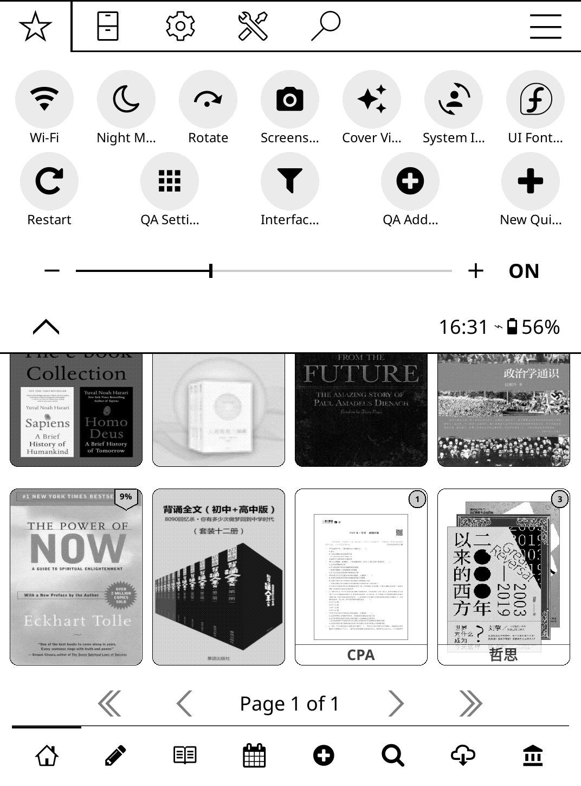</td>
    <td></td>
  </tr>
</table>

---

## 📄 许可证

本项目采用 **GNU Affero General Public License v3.0 (AGPL-3.0)** 许可证。

完整许可证文本请参见：[https://www.gnu.org/licenses/agpl-3.0.en.html](https://www.gnu.org/licenses/agpl-3.0.en.html)

---

## 🚀 核心功能

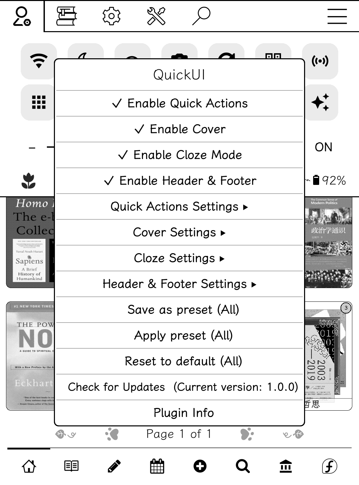

### 1. ⚡ 快捷操作

这是 QuickUI 最核心、最强大的功能模块，包含以下几个子模块：


#### 📌 1.1 快捷面板

在顶部菜单栏中集成的可自定义操作面板：

| 配置项 | 选项/说明 |
| :--- | :--- |
| **内置操作** | WiFi、夜间模式、旋转、截图、继续阅读、搜索、重启、退出、电源、HTTP 服务器、字体列表等 |
| **自定义操作** | 文件夹、收藏集、插件、系统操作（Dispatcher）、录制的菜单操作 |
| **图标选择器** | Nerd Font 图标、SVG/PNG 文件、系统图标替换 |
| **界面过滤** | 根据当前界面（文件管理器/阅读器）显示/隐藏操作 |
| **按钮形状** | 圆形 / 圆角方形 / 无边框 |
| **按钮背景** | 透明 / 实心 / 浅灰 |
| **按钮大小** | 60% ~ 150%（步进 5%） |
| **标签大小** | 50% ~ 200%（步进 10%） |
| **显示标签** | 开关 |
| **滑块** | 前光强度 / 色温（带数值显示） |
| **长按操作** | 编辑按钮 / 打开设置 |

<table>
  <tr>
    <td>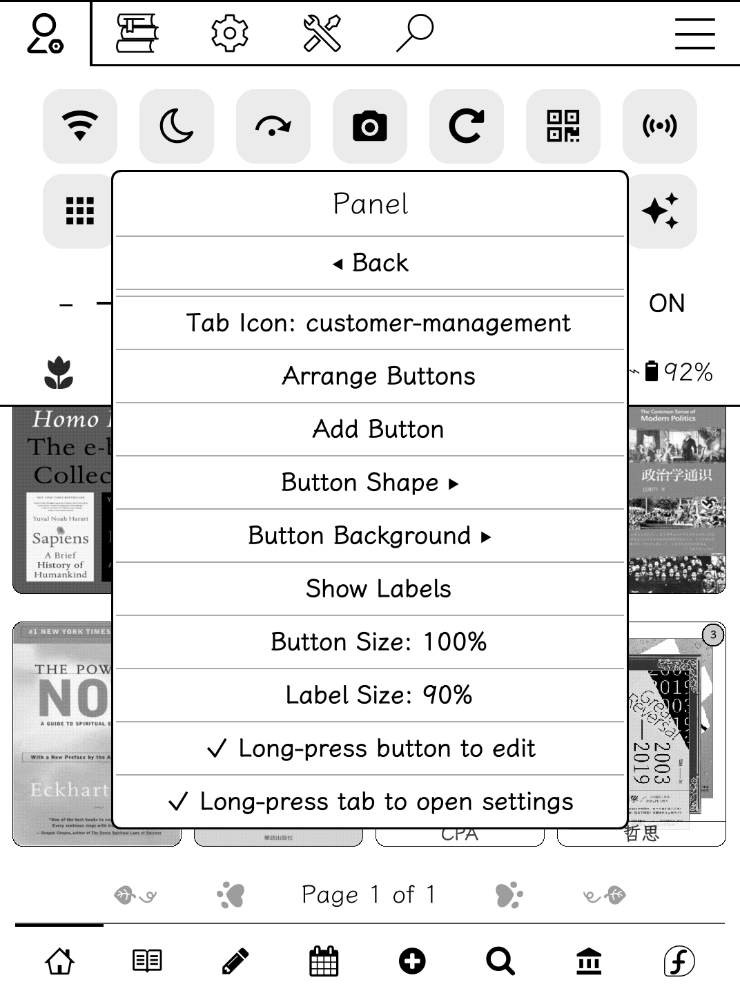</td>
    <td>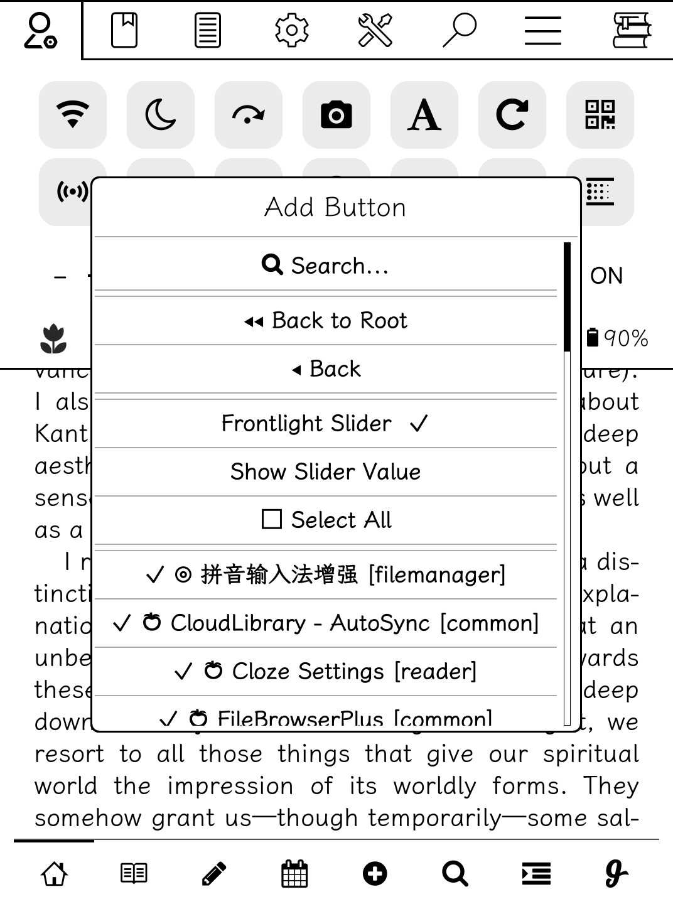</td>
  </tr>
</table>

**内置操作完整列表：**

| 操作 ID | 名称 | 界面 | 说明 |
| :--- | :--- | :--- | :--- |
| `home` | 主页 | 通用 | 返回文件管理器 |
| `wifi` | Wi-Fi | 通用 | 切换 Wi-Fi |
| `night` | 夜间模式 | 通用 | 切换夜间模式 |
| `rotate` | 旋转屏幕 | 通用 | 旋转屏幕 |
| `screenshot` | 截图（延迟4秒） | 通用 | 延迟截图 |
| `continue` | 继续阅读 | 通用 | 打开最近阅读的书籍 |
| `search` | 搜索 | 通用 | 全文搜索/文件搜索 |
| `quit` | 退出 | 通用 | 退出 KOReader |
| `restart` | 重启 | 通用 | 重启 KOReader |
| `power` | 电源 | 通用 | 电源菜单（休眠/重启/退出） |
| `httpinspector` | HTTP 服务器 | 通用 | 启动/停止 HTTP 调试服务器 |
| `fontlist` | 字体列表 | 阅读器 | 快速切换阅读字体 |
| `reading_insights` | 阅读统计 | 通用 | 显示阅读统计弹窗 |
| `filebrowserplus` | FileBrowserPlus | 通用 | 启动 FileBrowserPlus 插件 |
| `zlibrary_search` | ZLibrary 搜索 | 通用 | 启动 ZLibrary 搜索 |
| `cloudlibrary_autosync` | 云端书库-自动同步 | 通用 | 切换自动同步 |
| `cloudlibrary_batch_download_books` | 云端书库-批量下载 | 通用 | 批量下载书籍 |
| `cloudlibrary_settings` | 云端书库-设置 | 通用 | 云端书库设置 |
| `annotations_viewer` | 标注浏览器 | 通用 | 查看所有/当前书籍标注 |
| `quickui_settings` | QuickUI 设置 | 通用 | 打开 QuickUI 全局设置 |
| `qa_settings` | 快捷操作设置 | 通用 | 打开快捷操作设置 |
| `qa_new` | 新建快捷操作 | 通用 | 创建新的自定义操作 |
| `qa_panel_settings` | 面板设置 | 通用 | 快捷面板设置 |
| `qa_add_panel_button` | 添加面板按钮 | 通用 | 向面板添加按钮 |
| `qa_bb_settings` | 底部栏设置 | 通用 | 底部栏设置 |
| `qa_add_bb_tab` | 添加底部栏按钮 | 通用 | 向底部栏添加按钮 |
| `ui_font_switch` | UI 字体切换 | 通用 | 切换系统 UI 字体 |
| `system_icon_override` | 系统图标替换 | 通用 | 打开系统图标替换选择器 |
| `interface_filter` | 界面过滤 | 通用 | 打开界面过滤设置 |
| `toggle_cloze_mode` | 切换遮盖模式 | 阅读器 | 切换遮盖模式 |
| `QuickUI_CoverSettings` | 封面设置 | 文件管理器 | 封面视觉设置 |
| `QuickUI_ClozeSettings` | 遮盖设置 | 阅读器 | 遮盖模式设置 |
| `QuickUI_HFSettings` | 页眉页脚设置 | 阅读器 | 页眉页脚设置 |
| `qa_vb_toggle` | 切换垂直栏 | 通用 | 显示/隐藏侧边竖栏 |
| `qa_vb_settings` | 垂直栏设置 | 通用 | 打开侧边竖栏设置 |
| `qa_add_vb_button` | 添加垂直栏按钮 | 通用 | 向侧边竖栏添加按钮 |
| `reader_sliders` | 阅读滑块 | 阅读器 | 打开完整排版滑块弹窗 |
| `QuickUI_EditMetadata` | 编辑元数据 | 文件管理器 | 编辑选中书籍的元数据 |

<table>
  <tr>
    <td>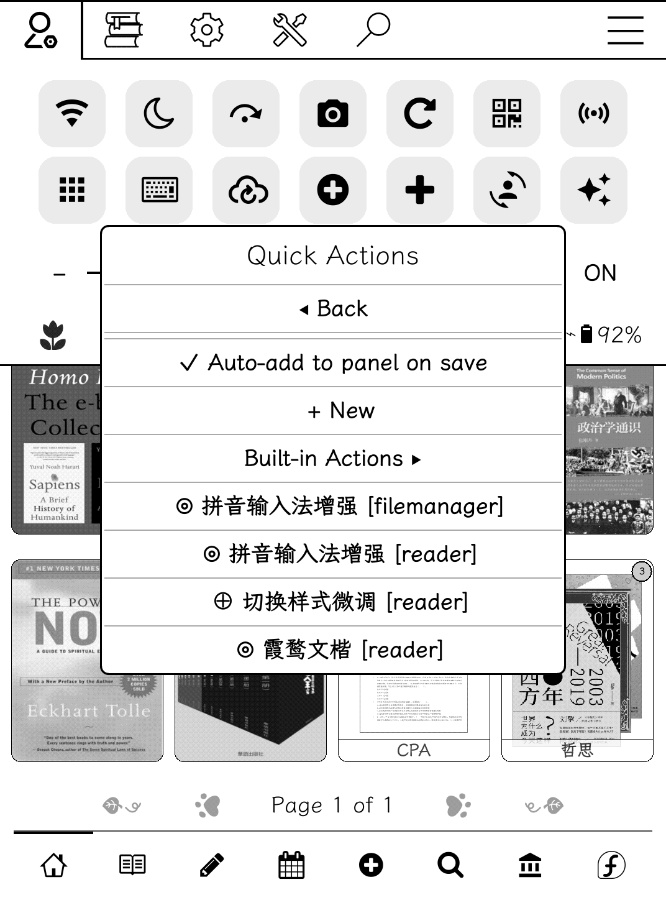</td>
    <td>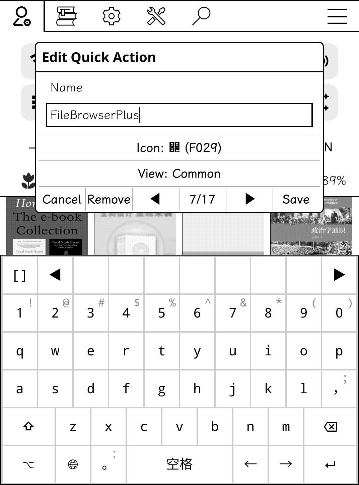</td>
  </tr>
</table>

#### 📌 1.2 底部栏

在屏幕底部显示的可自定义导航栏：

| 配置项 | 选项/说明 |
| :--- | :--- |
| **启用/禁用** | 全局开关 |
| **在阅读器中显示** | 是否在阅读界面显示 |
| **模式** | 仅图标 / 仅文字 / 两者 |
| **栏样式** | 默认 / 带边框 / 无边框 |
| **栏背景** | 实心 / 透明 |
| **颜色** | 背景色 / 前景色 / 非激活色 / 强调色（支持 HEX） |
| **栏大小** | 50% ~ 150%（步进 10%） |
| **图标大小** | 50% ~ 200%（步进 10%） |
| **标签大小** | 50% ~ 200%（步进 10%） |
| **显示标签** | 开关 |
| **按钮管理** | 添加/删除/排列 |
| **长按操作** | 编辑按钮 / 打开设置 |

<table>
  <tr>
    <td>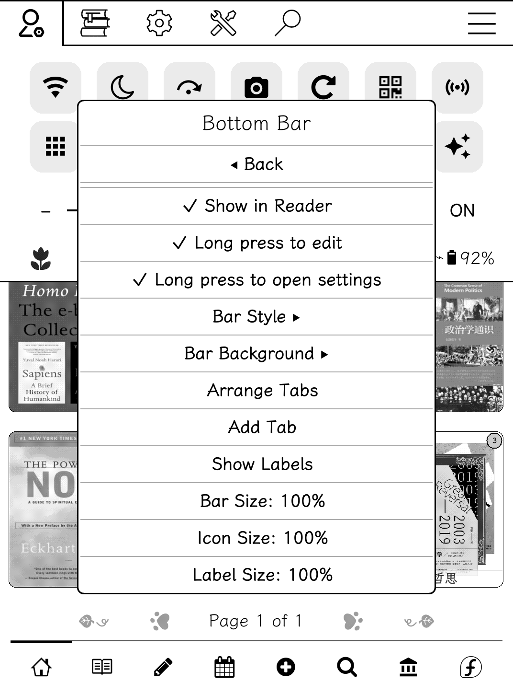</td>
    <td>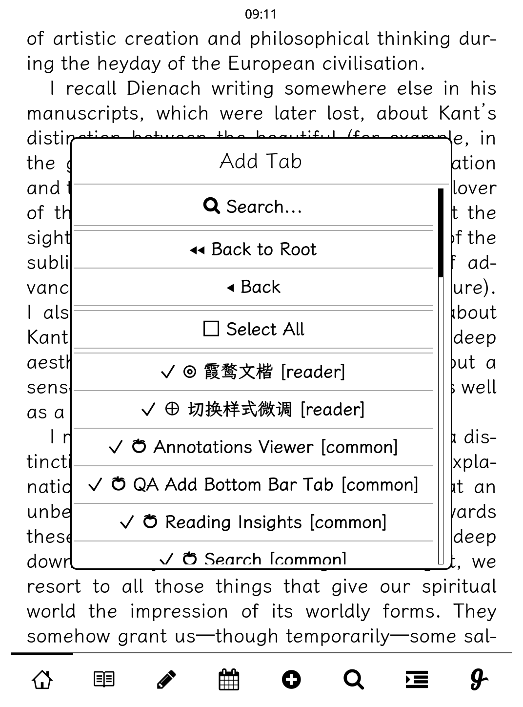</td>
  </tr>
</table>

#### 📌 1.3 侧边竖栏

贴边显示的竖排快捷启动栏。

**启用方式**：

| 方式 | 操作 |
| :--- | :--- |
| **QuickUI 设置** | 工具 → QuickUI → Quick Actions Settings → 垂直栏 → 勾选「启用垂直栏」 |
| **Dispatcher 动作** | 绑定 `QuickUI_VerticalBarToggle` 到手势 / 快捷键，触发一次切换显示/隐藏 |
| **快捷面板按钮** | 在面板或底部栏添加 `qa_vb_toggle`（「切换垂直栏」）按钮 |
| **内置操作池** | 添加 `qa_vb_settings`（打开设置）或 `qa_add_vb_button`（添加按钮）到面板 |

**操作方式**：

- **拖动**：横向滑动把栏移到屏幕另一侧
- **点按钮**：执行该操作
- **长按按钮**：编辑该按钮
- **上下滑**：翻页（若启用「滑动手势翻页」）
- **点栏外**：收起

**配置项**：

| 配置项 | 选项/说明 |
| :--- | :--- |
| **启用/禁用** | 全局开关 |
| **位置** | 左侧 / 右侧 |
| **背景** | 白色 / 浅灰 / 透明 |
| **动画** | 关 / 快 / 中 / 慢 |
| **滑动手势翻页** | 上下滑动切换按钮页 |
| **按钮管理** | 添加/删除/排列 |
| **标签显示** | 开关 |
| **栏大小** | 60% ~ 150%（步进 10%） |
| **图标大小** | 50% ~ 200%（步进 10%） |
| **标签大小** | 50% ~ 200%（步进 10%） |
| **长按操作** | 编辑按钮 / 打开设置 |

#### 📌 1.4 阅读排版滑块

阅读器内的排版调整滑块。

**启用方式**：

| 方式 | 操作 |
| :--- | :--- |
| **Dispatcher 动作** | 绑定 `QuickUI_ReaderSliders` 到手势 / 快捷键，打开完整弹窗 |
| **内置操作池** | 添加 `reader_sliders`（「阅读滑块」）到面板或竖栏，点一下打开弹窗 |
| **内嵌到面板/竖栏** | 在面板或竖栏设置里开启对应的滑块开关，直接显示内嵌滑块 |

**操作方式**：

- **左右拖动滑块**：调整数值
- **点 −/+ 按钮**：步进调整
- **点数值**：弹出 SpinWidget 精调，可设为默认值
- **长按标签**：重置为默认
- **长按滑块**：打开完整滑块列表弹窗

**滑块列表**：

| 滑块 | 说明 | 适用 |
| :--- | :--- | :--- |
| **字号** | 正文字号（12-90） | Reflowable（EPUB / FB2 / TXT） |
| **行距** | 行间距百分比（50-200%） | Reflowable |
| **对比度** | 字体 Gamma（10-56） | Reflowable / PDF |
| **左右边距** | 页面左右留白（0-140） | Reflowable |
| **上边距** | 页面上方留白（0-140） | Reflowable |
| **下边距** | 页面下方留白（0-140） | Reflowable |
| **PDF 对比度** | PDF 渲染对比度（0.8-50） | PDF / DJVU |
| **PDF 缩放** | 缩放因子、重叠、行/列数 | PDF / DJVU |
| **首行缩进** | 段落首行缩进方式 | Reflowable |
| **段间距** | 段落间距方式 | Reflowable |
| **CJK 优化** | 中日韩排版优化 | Reflowable |

#### 📌 1.5 自定义操作

支持五种类型的自定义快捷操作：

| 类型 | 说明 | 默认界面 |
| :--- | :--- | :--- |
| 📁 **文件夹** | 快速跳转到指定文件夹 | 文件管理器，可更改 |
| 📚 **收藏集** | 快速打开指定的收藏集 | 文件管理器，可更改 |
| 🔌 **插件/补丁** | 启动任意插件或菜单补丁 | 通用，可更改 |
| ⚙️ **系统操作** | 调用 Dispatcher 系统操作 | 自动判断，可更改 |
| 📋 **录制菜单操作** | 录制任意菜单项为快捷操作 | 自动判断，锁定（不可更改） |

<table>
  <tr>
    <td>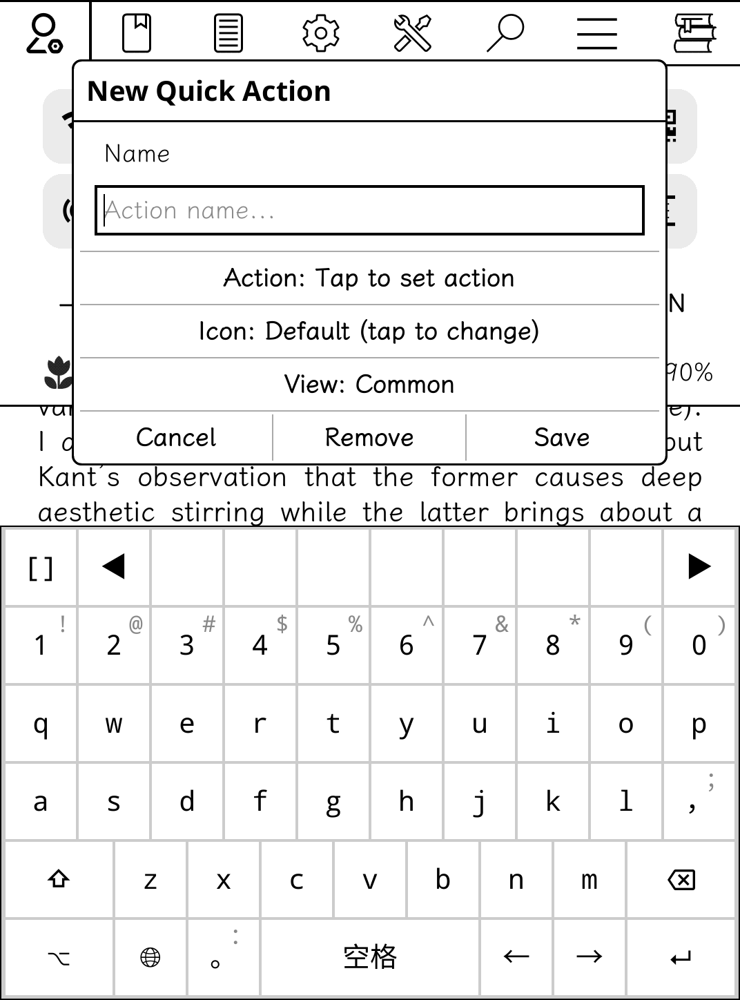</td>
    <td>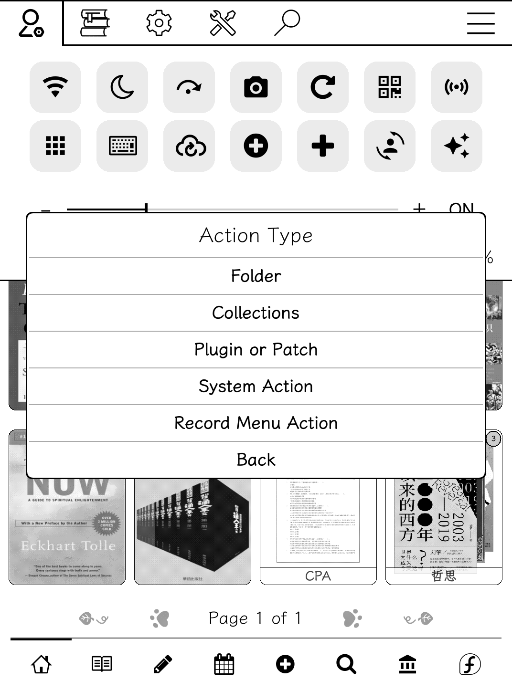</td>
  </tr>
</table>

#### 📌 1.6 图标选择器

| 功能 | 说明 |
| :--- | :--- |
| **Nerd Font 图标** | 自动扫描所有可用 Nerd Font 符号，按十六进制显示 |
| **文件图标** | 扫描 `icons/` 目录下的 SVG/PNG 文件 |
| **浏览文件** | 文件浏览器选择自定义图标 |
| **过滤** | 按名称或码点搜索图标 |
| **系统图标替换** | 替换系统内置图标（需要重启） |
| **批量操作** | 重置全部替换 / 应用全部替换 |

<table>
  <tr>
    <td>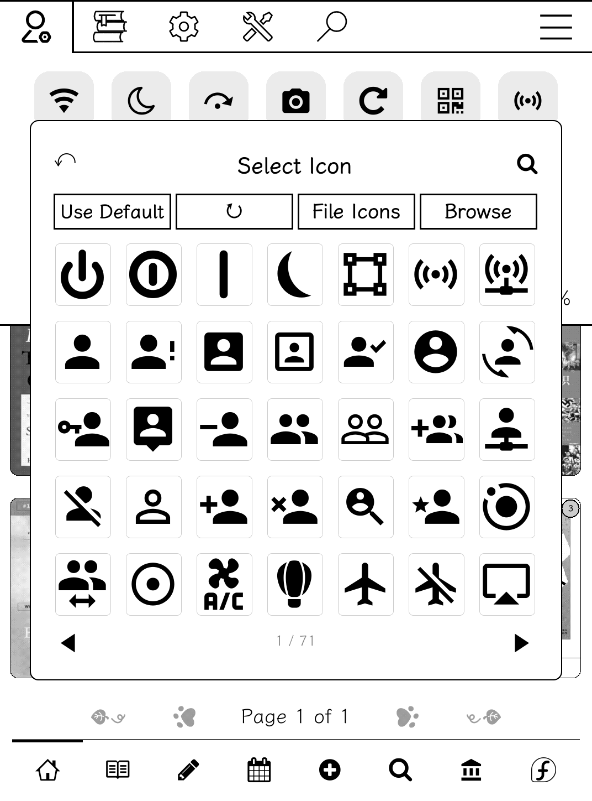</td>
    <td>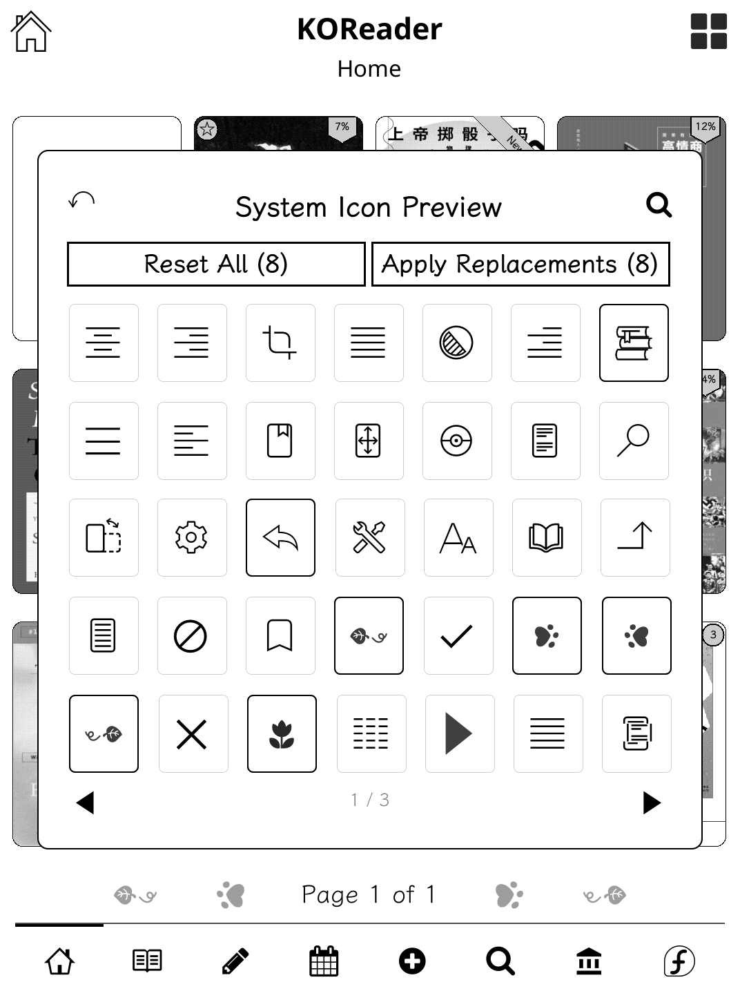</td>
  </tr>
</table>

#### 📌 1.7 UI 字体切换

| 字体类型 | 默认字体 | 说明 |
| :--- | :--- | :--- |
| **常规字体** | NotoSans-Regular.ttf | 主要 UI 字体 |
| **粗体字体** | NotoSans-Bold.ttf | 粗体 UI 字体 |
| **等宽字体** | DroidSansMono.ttf | 等宽 UI 字体 |

- 支持任意 TTF/OTF 字体
- 实时预览效果
- 一键重置所有字体

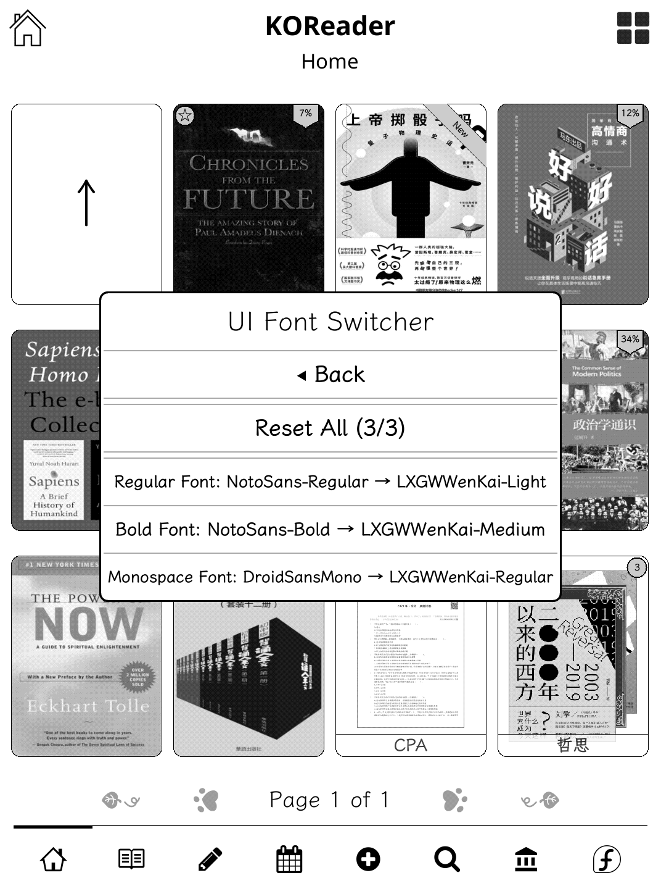

#### 📌 1.8 界面过滤

| 功能 | 说明 |
| :--- | :--- |
| **启用过滤** | 根据当前界面（文件管理器/阅读器）自动过滤可用操作 |
| **文件管理器专用** | 标记仅在文件管理器显示的操作 |
| **阅读器专用** | 标记仅在阅读器显示的操作 |
| **恢复默认** | 恢复所有操作到默认界面 |

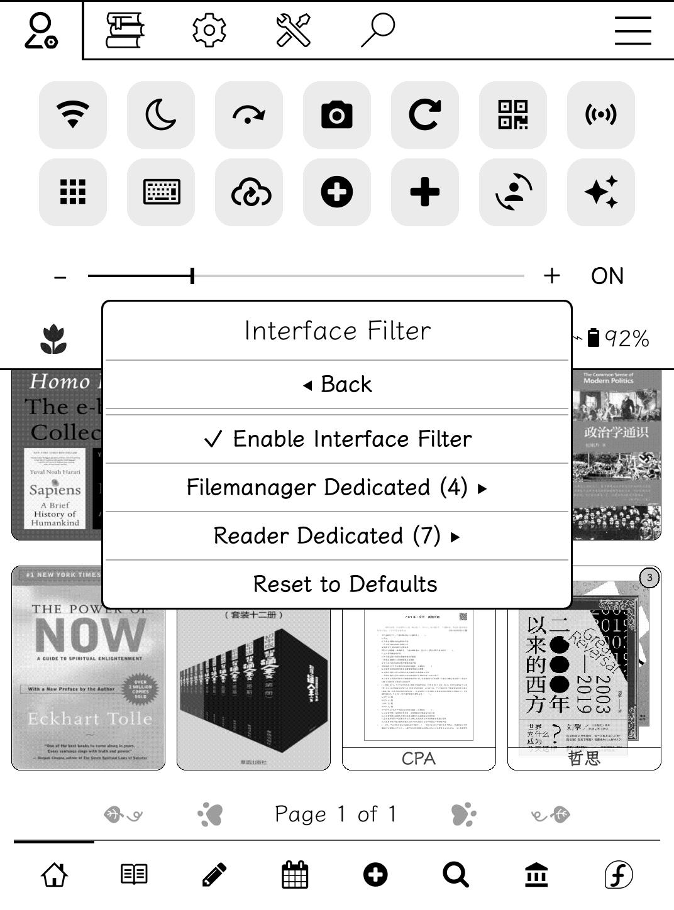

---

### 2. 🎨 封面美化

| 类别 | 选项 | 说明 |
| :--- | :--- | :--- |
| **占位封面** | 简单（白色背景）/ 渐变 | 无封面书籍的占位图样式 |
| **徽章大小** | 紧凑 / 正常 / 大 / 特大 | 徽章尺寸调整 |
| **徽章颜色** | 黑色 / 白色 / 灰色 / 蓝色 / 绿色 / 琥珀色 / 红色 | 徽章背景色 |
| **徽章显示** | 收藏星标 / 进度百分比 / NEW 横幅 / 完成书籍变暗 / 页数 / 格式 | 可单独开关 |
| **封面标题横幅** | 显示 / 居中 / 底部 / 不透明背景 | 在封面上显示书名 |
| **文件夹封面** | 画廊（四格拼贴）/ 堆叠（堆叠效果）/ 普通（第一张封面）/ 无（仅显示文件夹名） | 文件夹显示模式 |
| **文件夹装饰** | 书脊装饰线 / 文件数量 / 文件夹名称（居中/底部/不透明背景） | 文件夹封面细节 |
| **封面比例** | 3:4（默认）/ 2:3 | 封面宽高比 |
| **其他** | 封面圆角 / 封面下方显示标题 / 封面下方显示作者 / 隐藏下划线 / 隐藏返回上级 | 通用开关 |

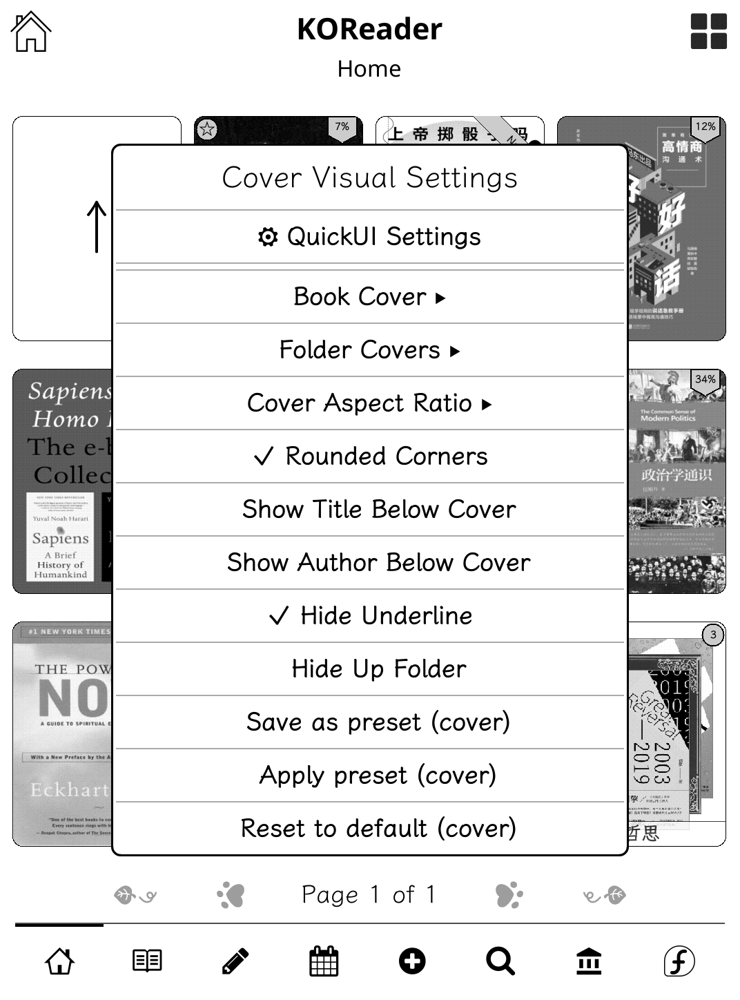

---

### 3. 🔍 遮盖模式

| 功能 | 说明 |
| :--- | :--- |
| **可遮盖标注** | 高亮、下划线、删除线、反色 |
| **切换方式** | 双击切换 / 单击（阻止菜单）/ 单击（显示菜单） |
| **可遮盖样式** | 可单独选择覆盖哪些标注类型 |
| **快捷操作** | 全部遮盖 / 全部取消遮盖 |
| **Dispatcher 操作** | `QuickUI_ClozeEnable`、`QuickUI_ClozeToggleAll`、`QuickUI_ClozeSettings` |

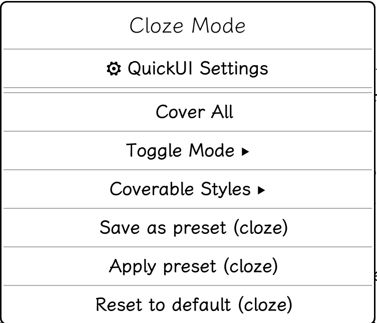

---

### 4. 📐 页眉页脚

| 配置项 | 选项 |
| :--- | :--- |
| **位置** | 顶部（左/中/右）/ 底部（左/中/右） |
| **内容** | 时间 / 页码（当前/总页数）/ 进度百分比 / 页码+进度 / 章节页码 / 作者 / 书名 / 章节名 / 电量 |
| **字体** | 可选字体名称 / 字号 / 粗体 |
| **边距** | 上边距 / 下边距 / 左偏移 / 右偏移 |
| **时间格式** | 24小时制 / 12小时制 |
| **进度小数位数** | 0、1 或 2 |
| **PDF 支持** | 是否在 PDF 文档中显示（默认禁用） |

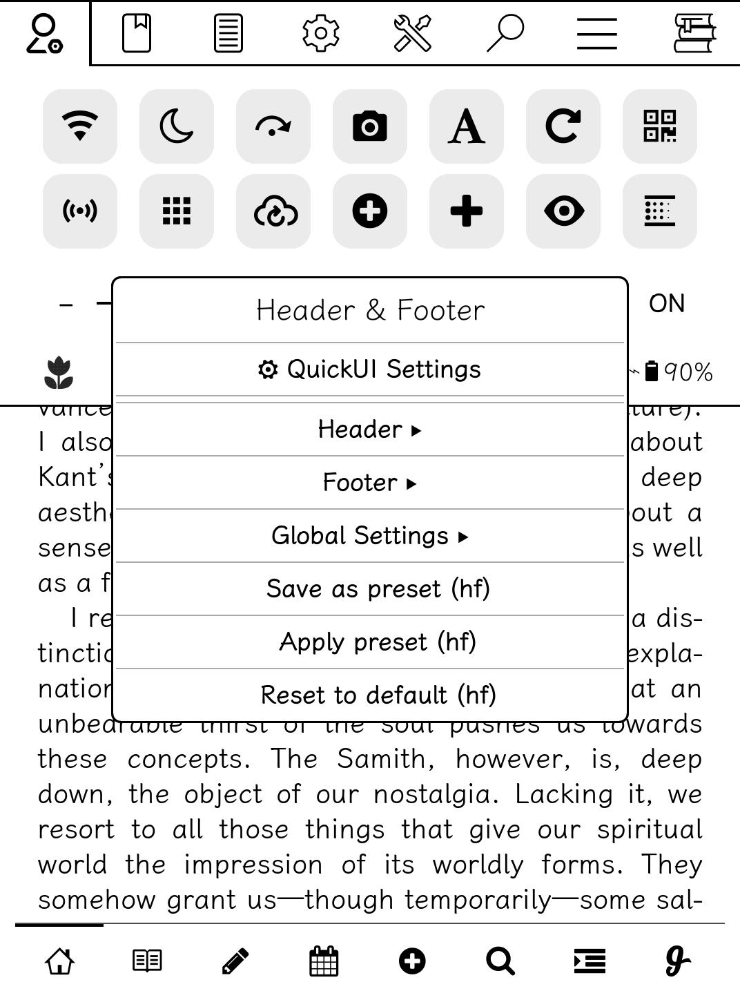

---

### 5. 📖 元数据编辑

编辑书籍的元数据（标题、作者、系列、分类、语言、出版社、简介），支持手动修改和在线搜索两种方式。

#### 可编辑字段

| 字段 | 说明 |
| :--- | :--- |
| **标题** | 书名 |
| **作者** | 多个作者，一行一个 |
| **系列** | 系列名称 + 系列位置 |
| **分类** | 多个分类，一行一个 |
| **语言** | ISO 代码，如 `zh`、`en`、`ja` |
| **出版社** | 出版社名称（仅 EPUB） |
| **简介** | 书籍简介，支持多段 |

#### 编辑方法

**手动修改**：点任意字段行，在弹出的输入框里直接编辑。改过的字段前面会显示 `●` 标记。

**在线搜索**：点「Find metadata online」，在弹出的搜索框里修改关键词，选择数据源（豆瓣、Google Books、Hardcover、Open Library）后搜索。搜索结果可逐条预览，满意后点「应用」。**手动改过的字段不会被在线数据覆盖**。

- 豆瓣、Open Library 无需配置，直接可用
- Google Books 需 API key，Hardcover 需 API token，未配置时点击会弹出输入框，配完自动搜索
- 未配置 key 的数据源，在列表里标注 `(API key required)`

#### 应用方式

**EPUB**：直接修改 EPUB 内嵌的 OPF 元数据，重新打包替换原文件。修改前会生成备份：

| 文件 | 用途 |
| :--- | :--- |
| `书名.epub.quickui-metadata.bak` | 修改前的原始 EPUB |
| `书名.epub.quickui-metadata.bak.json` | 配套的侧车快照 |

只要这两个文件在，编辑器里就会出现「恢复原始元数据」，可一键还原到修改前的版本。**确认不需要还原了，可以删除这两个文件**（书本身不受影响，下次再编辑时会自动生成新的备份）。

**非 EPUB（PDF、MOBI、AZW3、FB2、TXT 等）**：不修改原文件，而是在书的 `.sdr/` 文件夹里写入自定义元数据：
```
书名.sdr/
└── custom_metadata.lua
```

此元数据仅对 KOReader 生效，不会随文件拷贝到其他阅读器。删除该自定义元数据即可恢复。

#### 入口

**方式一：长按书籍**
- 在文件管理器、历史记录、收藏集、文件搜索结果里，**长按一本书** → 菜单里选「Edit metadata」
- 如果这本书正在阅读器中打开，此项会**灰掉**

**方式二：QuickUI 设置**
- 工具 → QuickUI → **Metadata Settings** → 「Edit current book's metadata」
- 如果文件管理器里有勾选的书，直接编辑；勾选多本时弹出列表让用户挑；没有勾选时提示先选书

**方式三：Dispatcher 动作**
- 动作名：`QuickUI_EditMetadata`
- 在**手势管理**里绑定到任意手势，或在 **Dispatcher** 设置里绑定到快捷键
- 触发时编辑文件管理器中当前选中的书

**方式四：快捷面板 / 竖栏按钮**
- 在快捷操作池里添加 `QuickUI_EditMetadata`（「编辑元数据」）操作
- 加到面板或竖栏后，点一下编辑当前选中的书

> ⚠️ **正在阅读器中打开的书无法编辑元数据**，请先关闭再操作。

#### 来源

本模块的元数据读写逻辑改编自 [zen_ui.koplugin](https://github.com/AnthonyGress/zen_ui.koplugin)（MIT 协议）。

在线数据源的抓取方式参考 [[metadata.koplugin]](https://github.com/ZHA30/metadata.koplugin)。

第三方库：

- **SLAXML / SLAXDOM**（v0.8，MIT，Copyright © 2013-2018 Gavin Kistner）—— XML 解析
- **ca-bundle.crt**（certifi 2026.6.17，MPL-2.0）—— HTTPS 证书校验

详见 [`LICENSES.md`](LICENSES.md)。

---

## 💡 轻量化替代方案：独立补丁

如果您觉得 QuickUI 插件功能过于丰富，或者只想使用其中某一个功能，有以下两种灵活的替代方案：

### 方案一：在 QuickUI 中按需禁用模块

您可以在 QuickUI 的设置菜单中，独立开启或关闭各功能模块，无需删除插件文件：

| 功能模块 | 设置入口 | 说明 |
| :--- | :--- | :--- |
| **快捷操作** | `工具 → QuickUI` | 取消勾选 **"启用快捷操作"** |
| **封面美化** | `工具 → QuickUI` | 取消勾选 **"启用封面美化"** |
| **遮盖模式** | `工具 → QuickUI` | 取消勾选 **"启用遮盖模式"** |
| **页眉页脚** | `工具 → QuickUI` | 取消勾选 **"启用页眉页脚"** |
| **元数据编辑** | `工具 → QuickUI` | 取消勾选 **"启用元数据编辑器"** |

> 禁用模块后，需要**重启 KOReader** 才能生效。

### 方案二：使用独立补丁（完全替代 QuickUI）

如果您希望获得更轻量、纯粹的单功能体验，可以直接使用以下独立补丁。这些补丁仅包含单一功能，代码更精简，也无需通过插件管理。

| 对应模块 | 独立补丁文件 | 功能描述 | 获取地址 |
| :--- | :--- | :--- | :--- |
| **快捷操作** | `2-quickactions.lua` | 可自定义的快捷操作面板 | [kopatches 仓库](https://github.com/gytwo/kopatches) |
| **封面美化** | `2-fm-cover.lua` | 全面的封面和文件夹封面视觉优化 | [kopatches 仓库](https://github.com/gytwo/kopatches) |
| **遮盖模式** | `2-reader-clozemode.lua` | 标注遮盖模式，用于复习和自测 | [kopatches 仓库](https://github.com/gytwo/kopatches) |

#### 独立补丁安装方法

1. 从 [gytwo/kopatches](https://github.com/gytwo/kopatches) 仓库下载对应的 `.lua` 文件。
2. 将文件放入 KOReader 的 `patches` 文件夹（通常为 `koreader/patches/`）。
3. 重启 KOReader 即可生效。

> 卸载独立补丁：直接删除对应的 `.lua` 文件即可，可选删除自动生成的配置文件。

---

## 🔧 手势/快捷键支持

| 操作名称 | Dispatcher 事件 | 适用界面 |
| :--- | :--- | :--- |
| 打开快捷面板 | `QuickUI_Panel` | 常规 |
| 快捷操作设置 | `QuickUI_QASettings` | 常规 |
| 封面设置 | `QuickUI_CoverSettings` | 文件管理器 |
| 启用/禁用遮盖 | `QuickUI_ClozeEnable` | 阅读器 |
| 全部遮盖/取消遮盖 | `QuickUI_ClozeToggleAll` | 阅读器 |
| 遮盖设置 | `QuickUI_ClozeSettings` | 阅读器 |
| 页眉页脚设置 | `QuickUI_HFSettings` | 阅读器 |
| 新建快捷操作 | `QuickUI_NewAction` | 常规 |
| 面板设置 | `QuickUI_PanelSettings` | 常规 |
| 添加面板按钮 | `QuickUI_AddPanelButton` | 常规 |
| 底部栏开关 | `QuickUI_BottombarToggle` | 常规 |
| 底部栏设置 | `QuickUI_BottombarSettings` | 常规 |
| 添加底部栏按钮 | `QuickUI_AddBottomBarTab` | 常规 |
| 切换侧边竖栏 | `QuickUI_VerticalBarToggle` | 常规 |
| 侧边竖栏设置 | `QuickUI_VerticalBarSettings` | 常规 |
| 添加侧边竖栏按钮 | `QuickUI_AddVerticalBarButton` | 常规 |
| 阅读排版滑块 | `QuickUI_ReaderSliders` | 阅读器 |
| 编辑元数据 | `QuickUI_EditMetadata` | 文件管理器 |

---

## 📁 文件结构
```
quickui.koplugin/
├── _meta.lua
├── changelog.lua
├── main.lua
├── README.md
├── README.zh_CN.md
├── LICENSES.md
│
├── locales/
│ └── zh_CN.po
│
├── qui_actions/
│ ├── qa_actions.lua # 动作注册表（内置 + 自定义）和执行逻辑
│ ├── qa_bar_settings.lua # 面板 / 底部栏 / 竖栏的编辑器与栏设置
│ ├── qa_bottombar.lua # 底部导航栏构建器
│ ├── qa_icon_picker.lua # 图标选择器（Nerd Font + SVG/PNG）
│ ├── qa_init.lua # Quick Actions 模块入口
│ ├── qa_menu_recorder.lua # 菜单动作录制器
│ ├── qa_panel.lua # 快捷面板构建器
│ ├── qa_plugin_scan.lua # 插件扫描器
│ ├── qa_reader_sliders.lua # 阅读排版滑块（字号/行距/页边距/PDF 缩放等）
│ ├── qa_settings.lua # Quick Actions 设置菜单
│ ├── qa_uifont.lua # UI 字体切换器
│ └── qa_vertical_bar.lua # 侧边竖栏构建器
│
├── qui_metadata/
│ ├── qm_init.lua # 元数据模块入口
│ ├── qm_editor.lua # 字段编辑器 UI
│ ├── qm_service.lua # 元数据读写调度（EPUB / sidecar）
│ ├── qm_epub.lua # EPUB OPF 解析、重打包、事务恢复
│ ├── qm_http.lua # 统一 HTTP / HTTPS 层
│ ├── qm_isbn.lua # ISBN 校验
│ ├── qm_google_books.lua # Google Books 数据源
│ ├── qm_hardcover.lua # Hardcover 数据源
│ ├── qm_open_library.lua # Open Library 数据源
│ ├── qm_douban.lua # 豆瓣数据源（HTML 抓取）
│ ├── qm_provider_picker.lua # 搜索源选择 / 搜索 / 结果预览
│ ├── qm_slaxml.lua # SLAXML v0.8（XML 解析）
│ ├── qm_slaxdom.lua # SLAXML DOM 封装
│ └── ca-bundle.crt # certifi 根证书链
│
├── qui_cover.lua # 封面美化模块
├── qui_clozemode.lua # 遮盖模式模块
├── qui_header_footer.lua # 页眉页脚模块
├── qui_i18n.lua # 国际化加载器
├── qui_updates.lua # 更新检查
└── qui_utils.lua # 通用工具函数
```

---

## ⚙️ 配置

所有设置存储在：`~/koreader/settings/quickui.lua`

默认配置定义在 `qui_utils.lua` 的 `DEFAULT_SETTINGS` 表中：

| 配置节 | 键前缀 | 说明 |
| :--- | :--- | :--- |
| 面板 | `qa_panel_*` | 面板启用、按钮布局、形状、大小、标签、滑块等 |
| 底部栏 | `qa_bb_*` | 底部栏启用、模式、样式、大小、颜色、标签等 |
| 侧边竖栏 | `qa_vb_*` | 侧边竖栏启用、位置、样式、大小、标签等 |
| 快捷操作通用 | `qa_common_*` | 自定义操作、界面过滤、图标替换、UI 字体替换等 |
| 封面 | `cover_*` | 封面样式、徽章、比例、圆角、文件夹模式等 |
| 遮盖 | `cl_*` | 遮盖启用、切换方式、可遮盖样式 |
| 页眉页脚 | `hf_*` | 页眉页脚启用、内容、字体、边距、时间格式等 |
| 元数据 | `metadata_*` | 元数据模块开关、Google Books API key、Hardcover token |

### 预设管理

每个模块都支持**保存为预设**、**应用预设**、**恢复默认**三个操作：

| 预设范围 | 涵盖模块 |
| :--- | :--- |
| 全部 | 面板 + 底部栏 + 侧边竖栏 + 快捷操作通用 + 封面 + 遮盖 + 页眉页脚 + 元数据 |
| 快捷操作 | 面板 + 底部栏 + 侧边竖栏 + 快捷操作通用 |
| 封面 | 仅封面设置 |
| 遮盖 | 仅遮盖设置 |
| 页眉页脚 | 仅页眉页脚设置 |
| 元数据 | 仅元数据设置 |

---

## 🌐 国际化

| 语言 | 支持 |
| :--- | :--- |
| 英文 | ✅ 默认 |
| 中文（简体/繁体） | ✅ 通过 `locales/zh_CN.po` |
| 其他语言 | 可添加 `.po` 文件到 `locales/` 目录 |

---

## 📦 更新

| 源 | 类型 | 说明 |
| :--- | :--- | :--- |
| GitHub（最新版） | 稳定版 | 最新正式发布版 |
| GitHub（预发布版） | 预发布版 | 测试版/开发版 |
| Gitee（最新版） | 稳定版 | 国内镜像源 |

更新流程：
1. 检查网络连接
2. 获取最新版本信息
3. 比较版本号
4. 下载 ZIP 包
5. 自动解压安装
6. 提示重启 KOReader

支持**回退**到任意历史版本。

---

## 🔌 兼容性与依赖

| 项目 | 要求 |
| :--- | :--- |
| **KOReader** | ≥ v2026.03 |
| **设备** | 前光/色温功能需要设备支持 |

---

## 🧑‍💻 开发者信息

- **作者**：gytwo
- **仓库**：[github.com/gytwo/quickui.koplugin](https://github.com/gytwo/quickui.koplugin)
- **许可证**：AGPL-3.0
