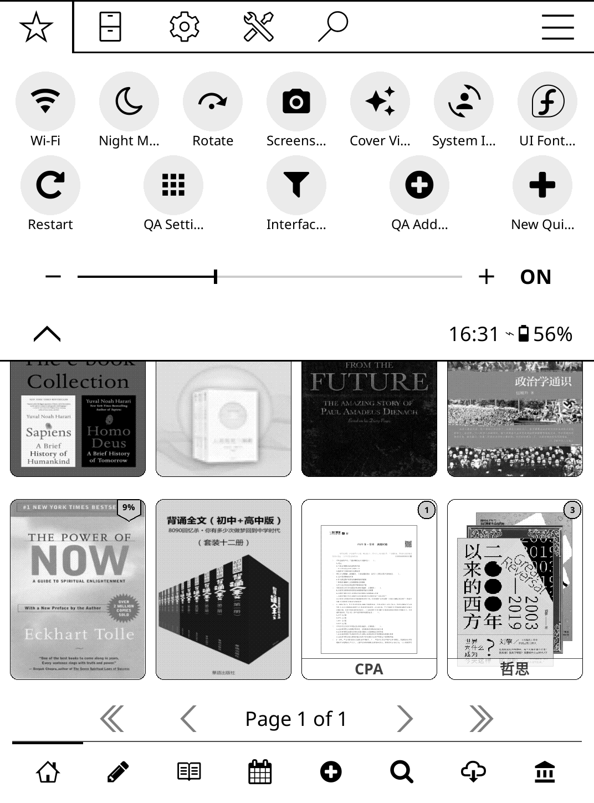
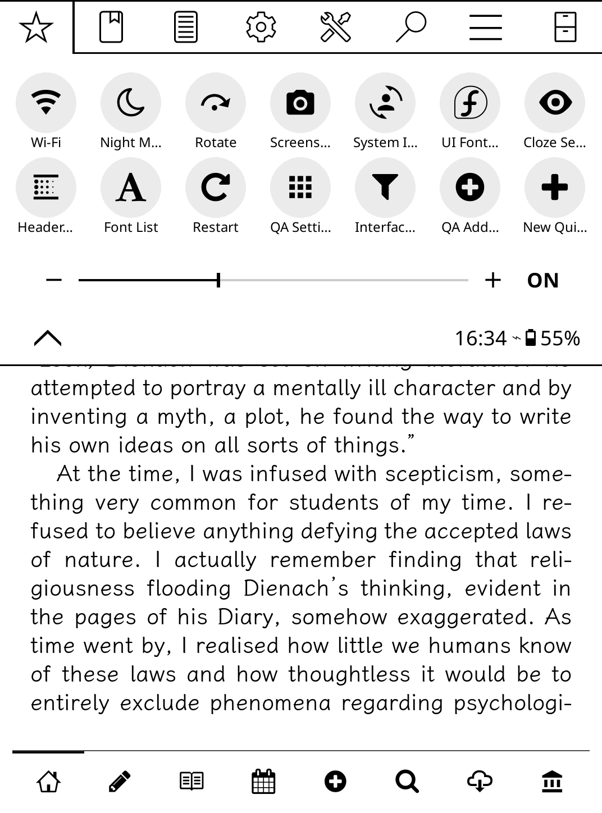

# QuickUI - KOReader 增强插件

> **QuickUI: 快捷操作 · 封面美化 · 遮盖模式 · 页眉页脚 — 更高效的 KOReader。**

> **版本**：v1.0.0 | **作者**：gytwo | **许可证**：AGPL-3.0 | **兼容**：KOReader ≥ v2026.03

---

## 📖 概述

QuickUI 是一个综合性 KOReader 增强插件，集成了**四大核心功能**，让您的阅读体验更流畅、更高效：

| 功能模块 | 描述 |
| :--- | :--- |
| ⚡ **快捷操作** | 可自定义的快捷操作中心：面板、底部栏、自定义动作、图标选择、UI 字体切换等 |
| 🎨 **封面美化** | 占位图、徽章、圆角、统一比例、文件夹预览等封面视觉优化 |
| 🔍 **遮盖模式** | 标注遮罩模式，用于复习和自测（高亮、下划线、删除线） |
| 📐 **页眉页脚** | 阅读页面顶部/底部显示时间、页码、进度、章节、电量等信息 |

> 💡 **灵感来源**：SimpleUI、ZenUI、ShortcutsToolbar




---

## 📄 许可证

本项目采用 **GNU Affero General Public License v3.0 (AGPL-3.0)** 许可证。

您可以：
- 出于任何目的使用本插件
- 修改和改编代码
- 分发原始或修改后的代码副本

但须遵守以下条件：
- 分发软件时必须**公开源代码**
- 必须**包含原始版权声明和许可证**
- 必须**说明您对代码所做的所有更改**
- 如果将软件作为**网络服务**运行，必须向用户提供源代码

完整许可证文本请参见：[https://www.gnu.org/licenses/agpl-3.0.en.html](https://www.gnu.org/licenses/agpl-3.0.en.html)

---

## 🚀 核心功能

### 1. ⚡ 快捷操作

这是 QuickUI 最核心、最强大的功能模块，包含以下几个子模块：

#### 📌 1.1 快捷面板

在顶部菜单栏中集成的可自定义操作面板：

| 配置项 | 选项/说明 |
| :--- | :--- |
| **内置操作** | WiFi、夜间模式、旋转、截图、继续阅读、搜索、重启、退出、电源、HTTP 服务器、字体列表等 |
| **自定义操作** | 文件夹、收藏集、插件、系统操作（Dispatcher）、录制的菜单操作 |
| **图标选择器** | Nerd Font 图标、SVG/PNG 文件、系统图标替换 |
| **界面过滤** | 根据当前界面（文件管理器/阅读器）显示/隐藏操作 |
| **按钮形状** | 圆形 / 圆角方形 / 无边框 |
| **按钮背景** | 透明 / 实心 / 浅灰 |
| **按钮大小** | 60% ~ 150%（步进 5%） |
| **标签大小** | 50% ~ 200%（步进 10%） |
| **显示标签** | 开关 |
| **滑块** | 前光强度 / 色温（带数值显示） |
| **长按操作** | 编辑按钮 / 打开设置 |

**内置操作完整列表：**

| 操作 ID | 名称 | 界面 | 说明 |
| :--- | :--- | :--- | :--- |
| `home` | 主页 | 通用 | 返回文件管理器 |
| `wifi` | Wi-Fi | 通用 | 切换 Wi-Fi |
| `night` | 夜间模式 | 通用 | 切换夜间模式 |
| `rotate` | 旋转屏幕 | 通用 | 旋转屏幕 |
| `screenshot` | 截图（延迟4秒） | 通用 | 延迟截图 |
| `continue` | 继续阅读 | 通用 | 打开最近阅读的书籍 |
| `search` | 搜索 | 通用 | 全文搜索/文件搜索 |
| `quit` | 退出 | 通用 | 退出 KOReader |
| `restart` | 重启 | 通用 | 重启 KOReader |
| `power` | 电源 | 通用 | 电源菜单（休眠/重启/退出） |
| `httpinspector` | HTTP 服务器 | 通用 | 启动/停止 HTTP 调试服务器 |
| `fontlist` | 字体列表 | 阅读器 | 快速切换阅读字体 |
| `reading_insights` | 阅读统计 | 通用 | 显示阅读统计弹窗 |
| `filebrowserplus` | FileBrowserPlus | 通用 | 启动 FileBrowserPlus 插件 |
| `zlibrary_search` | ZLibrary 搜索 | 通用 | 启动 ZLibrary 搜索 |
| `cloudlibrary_autosync` | 云端书库-自动同步 | 通用 | 切换自动同步 |
| `cloudlibrary_batch_download_books` | 云端书库-批量下载 | 通用 | 批量下载书籍 |
| `cloudlibrary_settings` | 云端书库-设置 | 通用 | 云端书库设置 |
| `annotations_viewer` | 标注浏览器 | 通用 | 查看所有/当前书籍标注 |
| `quickui_settings` | QuickUI 设置 | 通用 | 打开 QuickUI 全局设置 |
| `qa_settings` | 快捷操作设置 | 通用 | 打开快捷操作设置 |
| `qa_new` | 新建快捷操作 | 通用 | 创建新的自定义操作 |
| `qa_panel_settings` | 面板设置 | 通用 | 快捷面板设置 |
| `qa_add_panel_button` | 添加面板按钮 | 通用 | 向面板添加按钮 |
| `qa_bb_settings` | 底部栏设置 | 通用 | 底部栏设置 |
| `qa_add_bb_tab` | 添加底部栏按钮 | 通用 | 向底部栏添加按钮 |
| `ui_font_switch` | UI 字体切换 | 通用 | 切换系统 UI 字体 |
| `system_icon_override` | 系统图标替换 | 通用 | 打开系统图标替换选择器 |
| `interface_filter` | 界面过滤 | 通用 | 打开界面过滤设置 |
| `toggle_cloze_mode` | 切换遮盖模式 | 阅读器 | 切换遮盖模式 |
| `QuickUI_CoverSettings` | 封面设置 | 文件管理器 | 封面视觉设置 |
| `QuickUI_ClozeSettings` | 遮盖设置 | 阅读器 | 遮盖模式设置 |
| `QuickUI_HFSettings` | 页眉页脚设置 | 阅读器 | 页眉页脚设置 |

#### 📌 1.2 底部栏

在屏幕底部显示的可自定义导航栏：

| 配置项 | 选项/说明 |
| :--- | :--- |
| **启用/禁用** | 全局开关 |
| **在阅读器中显示** | 是否在阅读界面显示 |
| **模式** | 仅图标 / 仅文字 / 两者 |
| **栏样式** | 默认 / 带边框 / 无边框 |
| **栏背景** | 实心 / 透明 |
| **颜色** | 背景色 / 前景色 / 非激活色 / 强调色（支持 HEX） |
| **栏大小** | 50% ~ 150%（步进 10%） |
| **图标大小** | 50% ~ 200%（步进 10%） |
| **标签大小** | 50% ~ 200%（步进 10%） |
| **显示标签** | 开关 |
| **按钮管理** | 添加/删除/排列 |
| **长按操作** | 编辑按钮 / 打开设置 |

#### 📌 1.3 自定义操作

支持五种类型的自定义快捷操作：

| 类型 | 说明 | 默认界面 |
| :--- | :--- | :--- |
| 📁 **文件夹** | 快速跳转到指定文件夹 | 文件管理器，可更改 |
| 📚 **收藏集** | 快速打开指定的收藏集 | 文件管理器 ，可更改|
| 🔌 **插件/补丁** | 启动任意插件或菜单补丁 | 通用 ，可更改|
| ⚙️ **系统操作** | 调用 Dispatcher 系统操作 | 自动判断，可更改 |
| 📋 **录制菜单操作** | 录制任意菜单项为快捷操作 | 自动判断，锁定（不可更改） |

#### 📌 1.4 图标选择器

| 功能 | 说明 |
| :--- | :--- |
| **Nerd Font 图标** | 自动扫描所有可用 Nerd Font 符号，按十六进制显示 |
| **文件图标** | 扫描 `icons/` 目录下的 SVG/PNG 文件 |
| **浏览文件** | 文件浏览器选择自定义图标 |
| **过滤** | 按名称或码点搜索图标 |
| **系统图标替换** | 替换系统内置图标（需要重启） |
| **批量操作** | 重置全部替换 / 应用全部替换 |

#### 📌 1.5 UI 字体切换

| 字体类型 | 默认字体 | 说明 |
| :--- | :--- | :--- |
| **常规字体** | NotoSans-Regular.ttf | 主要 UI 字体 |
| **粗体字体** | NotoSans-Bold.ttf | 粗体 UI 字体 |
| **等宽字体** | DroidSansMono.ttf | 等宽 UI 字体 |

- 支持任意 TTF/OTF 字体
- 实时预览效果
- 一键重置所有字体

#### 📌 1.6 界面过滤

| 功能 | 说明 |
| :--- | :--- |
| **启用过滤** | 根据当前界面（文件管理器/阅读器）自动过滤可用操作 |
| **文件管理器专用** | 标记仅在文件管理器显示的操作 |
| **阅读器专用** | 标记仅在阅读器显示的操作 |
| **恢复默认** | 恢复所有操作到通用界面 |

---

### 2. 🎨 封面美化

| 类别 | 选项 | 说明 |
| :--- | :--- | :--- |
| **占位封面** | 简单（白色背景）/ 渐变 | 无封面书籍的占位图样式 |
| **徽章大小** | 紧凑 / 正常 / 大 / 特大 | 徽章尺寸调整 |
| **徽章颜色** | 黑色 / 白色 / 灰色 / 蓝色 / 绿色 / 琥珀色 / 红色 | 徽章背景色 |
| **徽章显示** | 收藏星标 / 进度百分比 / NEW 横幅 / 完成书籍变暗 / 页数 / 格式 | 可单独开关 |
| **封面标题横幅** | 显示 / 居中 / 底部 / 不透明背景 | 在封面上显示书名 |
| **文件夹封面** | 画廊（四格拼贴）/ 堆叠（堆叠效果）/ 普通（第一张封面）/ 无（仅显示文件夹名） | 文件夹显示模式 |
| **文件夹装饰** | 书脊装饰线 / 文件数量 / 文件夹名称（居中/底部/不透明背景） | 文件夹封面细节 |
| **封面比例** | 3:4（默认）/ 2:3 | 封面宽高比 |
| **其他** | 封面圆角 / 封面下方显示标题 / 封面下方显示作者 / 隐藏下划线 / 隐藏返回上级 | 通用开关 |

---

### 3. 🔍 遮盖模式

| 功能 | 说明 |
| :--- | :--- |
| **可遮盖标注** | 高亮、下划线、删除线、反色 |
| **切换方式** | 双击切换 / 单击（阻止菜单）/ 单击（显示菜单） |
| **可遮盖样式** | 可单独选择覆盖哪些标注类型 |
| **快捷操作** | 全部遮盖 / 全部取消遮盖 |
| **Dispatcher 操作** | `QuickUI_ClozeEnable`、`QuickUI_ClozeToggleAll`、`QuickUI_ClozeSettings` |

---

### 4. 📐 页眉页脚

| 配置项 | 选项 |
| :--- | :--- |
| **位置** | 顶部（左/中/右）/ 底部（左/中/右） |
| **内容** | 时间 / 页码（当前/总页数）/ 进度百分比 / 页码+进度 / 章节页码 / 作者 / 书名 / 章节名 / 电量 |
| **字体** | 可选字体名称 / 字号 / 粗体 |
| **边距** | 上边距 / 下边距 / 左偏移 / 右偏移 |
| **时间格式** | 24小时制 / 12小时制 |
| **进度小数位数** | 0、1 或 2 |
| **PDF 支持** | 是否在 PDF 文档中显示（默认禁用） |

---

## 💡 轻量化替代方案：独立补丁

如果您觉得 QuickUI 插件功能过于丰富，或者只想使用其中某一个功能，有以下两种灵活的替代方案：

### 方案一：在 QuickUI 中按需禁用模块

您可以在 QuickUI 的设置菜单中，独立开启或关闭四大功能模块，无需删除插件文件：

| 功能模块 | 设置入口 | 说明 |
| :--- | :--- | :--- |
| **快捷操作** | `设置 → 插件管理 → QuickUI` | 取消勾选 **"启用快捷操作"** |
| **封面美化** | `设置 → 插件管理 → QuickUI` | 取消勾选 **"启用封面美化"** |
| **遮盖模式** | `设置 → 插件管理 → QuickUI` | 取消勾选 **"启用遮盖模式"** |
| **页眉页脚** | `设置 → 插件管理 → QuickUI` | 取消勾选 **"启用页眉页脚"** |

> 禁用模块后，需要**重启 KOReader** 才能生效。

### 方案二：使用独立补丁（完全替代 QuickUI）

如果您希望获得更轻量、纯粹的单功能体验，可以直接使用以下独立补丁。这些补丁仅包含单一功能，代码更精简，也无需通过插件管理。

这三个补丁的作者与 QuickUI 相同，功能一脉相承：

| 对应模块 | 独立补丁文件 | 功能描述 | 获取地址 |
| :--- | :--- | :--- | :--- |
| **快捷操作** | `2-quickactions.lua` | 可自定义的快捷操作面板（与 QuickUI 中的面板功能一致） | [kopatches 仓库](https://github.com/gytwo/kopatches) |
| **封面美化** | `2-fm-cover.lua` | 全面的封面和文件夹封面视觉优化 | [kopatches 仓库](https://github.com/gytwo/kopatches) |
| **遮盖模式** | `2-reader-clozemode.lua` | 标注遮盖模式，用于复习和自测 | [kopatches 仓库](https://github.com/gytwo/kopatches) |

#### 独立补丁安装方法

1. 从 [gytwo/kopatches](https://github.com/gytwo/kopatches) 仓库下载对应的 `.lua` 文件。
2. 将文件放入 KOReader 的 `patches` 文件夹（通常为 `koreader/patches/`）。
3. 重启 KOReader 即可生效。

> 卸载独立补丁：直接删除对应的 `.lua` 文件即可，可选删除自动生成的配置文件。

#### 如何选择？

| 场景 | 推荐方案 |
| :--- | :--- |
| 希望**集成管理**所有功能，喜欢 All-in-One | 使用 **QuickUI 插件**，并按需禁用模块 |
| 只对**某一个功能**感兴趣，追求极简 | 使用对应的 **独立补丁** |
| 想尝鲜或试用特定功能 | 先试用独立补丁，再决定是否迁移到 QuickUI |

> 💡 **提示**：QuickUI 与独立补丁**不要同时安装**，否则可能导致功能冲突。请根据需要二选一。

---

## 🔧 手势/快捷键支持

| 操作名称 | Dispatcher 事件 | 适用界面 |
| :--- | :--- | :--- |
| 打开快捷面板 | `QuickUI_Panel` | 文件管理器 / 阅读器 |
| 快捷操作设置 | `QuickUI_QASettings` | 文件管理器 / 阅读器 |
| 封面设置 | `QuickUI_CoverSettings` | 文件管理器 |
| 启用/禁用遮盖 | `QuickUI_ClozeEnable` | 阅读器 |
| 全部遮盖/取消遮盖 | `QuickUI_ClozeToggleAll` | 阅读器 |
| 遮盖设置 | `QuickUI_ClozeSettings` | 阅读器 |
| 页眉页脚设置 | `QuickUI_HFSettings` | 阅读器 |
| 新建快捷操作 | `QuickUI_NewAction` | 文件管理器 / 阅读器 |
| 面板设置 | `QuickUI_PanelSettings` | 文件管理器 / 阅读器 |
| 添加面板按钮 | `QuickUI_AddPanelButton` | 文件管理器 / 阅读器 |
| 底部栏开关 | `QuickUI_BottombarToggle` | 文件管理器 / 阅读器 |
| 底部栏设置 | `QuickUI_BottombarSettings` | 文件管理器 / 阅读器 |
| 添加底部栏按钮 | `QuickUI_AddBottomBarTab` | 文件管理器 / 阅读器 |

---

## 📁 文件结构
```
quickui.koplugin/
├── _meta.lua
├── changelog.lua
├── main.lua
├── README.md
├── README.zh_CN.md
│
├── locales/
│   └── zh_CN.po
│
├── qui_actions/
│   ├── qa_actions.lua
│   ├── qa_bottombar.lua
│   ├── qa_icon_picker.lua
│   ├── qa_init.lua
│   ├── qa_menu_recorder.lua
│   ├── qa_panel.lua
│   ├── qa_plugin_scan.lua
│   ├── qa_settings.lua
│   └── qa_uifont.lua
│
├── qui_cover.lua
├── qui_clozemode.lua
├── qui_header_footer.lua
├── qui_i18n.lua
├── qui_updates.lua
└── qui_utils.lua
```
| 文件 | 用途 |
| :--- | :--- |
| `_meta.lua` | 插件元数据（名称、版本、作者） |
| `changelog.lua` | 版本历史和更新记录 |
| `main.lua` | 主入口，注册 Dispatcher 动作，构建主菜单 |
| `README.md` | 英文说明文档 |
| `README.zh_CN.md` | 中文说明文档 |
| `locales/zh_CN.po` | 简体中文翻译 |
| `qui_actions/qa_actions.lua` | 动作注册表（内置 + 自定义）和执行逻辑 |
| `qui_actions/qa_bottombar.lua` | 底部导航栏构建器 |
| `qui_actions/qa_icon_picker.lua` | 图标选择器（Nerd Font + SVG/PNG） |
| `qui_actions/qa_init.lua` | Quick Actions 模块入口 |
| `qui_actions/qa_menu_recorder.lua` | 菜单动作录制器（用于自定义动作） |
| `qui_actions/qa_panel.lua` | 快捷面板构建器 |
| `qui_actions/qa_plugin_scan.lua` | 插件扫描器 |
| `qui_actions/qa_settings.lua` | Quick Actions 设置菜单 |
| `qui_actions/qa_uifont.lua` | UI 字体切换器 |
| `qui_cover.lua` | 封面美化模块 |
| `qui_clozemode.lua` | 遮盖模式模块 |
| `qui_header_footer.lua` | 页眉页脚模块 |
| `qui_i18n.lua` | 国际化加载器（加载 .po 文件） |
| `qui_updates.lua` | 更新检查（GitHub / Gitee） |
| `qui_utils.lua` | 通用工具函数（配置、序列化、字体、颜色） |

---

## ⚙️ 配置

所有设置存储在：`~/.adds/koreader/settings/quickui.lua`

默认配置定义在 `qui_utils.lua` 的 `DEFAULT_SETTINGS` 表中：

| 配置节 | 键前缀 | 说明 |
| :--- | :--- | :--- |
| 面板 | `qa_panel_*` | 面板启用、按钮布局、形状、大小、标签、滑块等 |
| 底部栏 | `qa_bb_*` | 底部栏启用、模式、样式、大小、颜色、标签等 |
| 快捷操作通用 | `qa_common_*` | 自定义操作、界面过滤、图标替换、UI 字体替换等 |
| 封面 | `cover_*` | 封面样式、徽章、比例、圆角、文件夹模式等 |
| 遮盖 | `cl_*` | 遮盖启用、切换方式、可遮盖样式 |
| 页眉页脚 | `hf_*` | 页眉页脚启用、内容、字体、边距、时间格式等 |

### 预设管理

每个模块都支持**保存为预设**、**应用预设**、**恢复默认**三个操作：

| 预设范围 | 涵盖模块 |
| :--- | :--- |
| 全部 | 面板 + 底部栏 + 快捷操作通用 + 封面 + 遮盖 + 页眉页脚 |
| 快捷操作 | 面板 + 底部栏 + 快捷操作通用 |
| 封面 | 仅封面设置 |
| 遮盖 | 仅遮盖设置 |
| 页眉页脚 | 仅页眉页脚设置 |

---

## 🌐 国际化

| 语言 | 支持 |
| :--- | :--- |
| 英文 | ✅ 默认 |
| 中文（简体/繁体） | ✅ 通过 `locales/zh_CN.po` |
| 其他语言 | 可添加 `.po` 文件到 `locales/` 目录 |

---

## 📦 更新

| 源 | 类型 | 说明 |
| :--- | :--- | :--- |
| GitHub（最新版） | 稳定版 | 最新正式发布版 |
| GitHub（预发布版） | 预发布版 | 测试版/开发版 |
| Gitee（最新版） | 稳定版 | 国内镜像源 |

更新流程：
1. 检查网络连接
2. 获取最新版本信息
3. 比较版本号
4. 下载 ZIP 包
5. 自动解压安装
6. 提示重启 KOReader

支持**降级**到任意历史版本。

---

## 🔌 兼容性与依赖

| 项目 | 要求 |
| :--- | :--- |
| **KOReader** | ≥ v2026.03 |
| **设备** | 前光/色温功能需要设备支持 |

---

## 📝 更新日志

### v1.0.0 (2026-07-04)

**新增功能**

- 四大核心功能集成：快捷操作、封面美化、遮盖模式、页眉页脚
- 快捷操作：28+ 内置操作（WiFi、夜间模式、旋转、截图等）
- 快捷操作：支持自定义操作（文件夹、收藏集、插件、系统操作、录制菜单操作）
- 快捷操作：图标选择器（Nerd Font + SVG/PNG + 系统图标替换）
- 快捷操作：界面过滤（文件管理器/阅读器自动切换）
- 快捷操作：底部导航栏（可自定义按钮、样式、颜色）
- 封面美化：占位图、徽章（收藏/进度/NEW/页数/格式）、圆角、统一比例
- 封面美化：文件夹封面（画廊/堆叠/普通/无）
- 遮盖模式：标注遮罩（高亮/下划线/删除线/反色），三种切换方式
- 页眉页脚：时间、页码、进度、章节、作者、书名、电量
- UI 字体切换：常规/粗体/等宽字体替换
- 国际化支持（中文翻译）
- 在线更新（GitHub/Gitee）

**改进**

- 统一配置管理（`quickui.lua`）
- 模块独立禁用/启用
- 预设管理（保存/应用/重置）

**修复**

- 无（初始版本）

---

## 🧑‍💻 开发者信息

- **作者**：gytwo
- **仓库**：[github.com/gytwo/quickui.koplugin](https://github.com/gytwo/quickui.koplugin)
- **许可证**：AGPL-3.0
